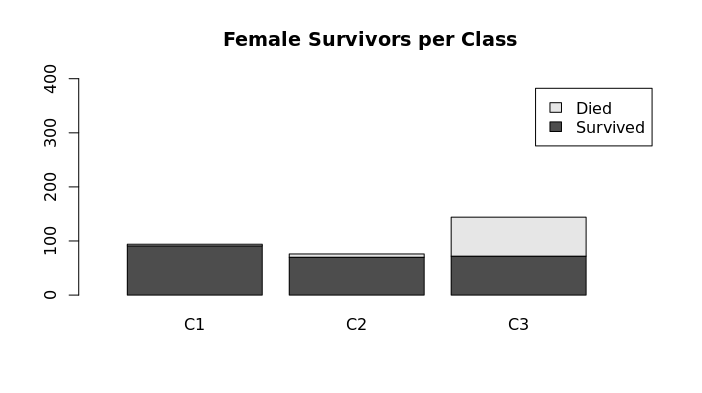

### *By Ariel Rider*

In this analysis, I will predict the survival rate of passengers on the
RMS Titanic using the ship's passenger data from the online Kaggle
challenge "Titanic - Machine Learning from Disaster".

# Program set up

Downloaded "train.csv" and "test.csv".

**Train.csv** contains passenger data and states who survived in the
"survived" column, 1 = survived and 0 =
died.{width="8.302083333333334in"
height="1.2564260717410323in"}

**Test.csv** does not contain a survived column. Based on patterns I
find in train.csv I will predict how many passengers in test.csv
survived. {width="8.46875in"
height="1.1236472003499562in"}

## **Key Terms** 

**Survived** - the column with data on whether or not the passenger
lived. 1 = lived

and 0 = died.

**Pclass** - the social class of the passenger, there were three classes
on board the titanic. 1st class = 1, 2nd class = 2, and 3rd class = 3.

**Sex** - The gender of the passenger(male/female).

**Highlighted Text** - R code

## Anti-corruption Measures

I made a copy of the train.csv dataset (TrainAttempt) to avoid potential
corruption.

TrainAttempt \<- subset(train)

## Goals

-   Determine the main factors for passenger survival

-   Predict results for the test dataset

# How many died in the train.csv dataset overall? 

549 out of 891 passengers died(62%), there were only 342 survivors(38%)

## Death Numbers Code

Survived \<- subset(train, Survived==1)

Died \<- subset(train, Survived==0)

{width="6.5in"
height="0.18055555555555555in"}

{width="6.5in"
height="0.2638888888888889in"}

## Total Deaths Graph Code

TotalD \<- read.table(text = \"Passengers

1 549

2 342\", header = TRUE)

title(\"Total Deaths\"){width="6.5in"
height="3.638888888888889in"}

barplot(as.matrix(TotalD), xlim = c(0, 1.75), ylim = c(0,1000),
legend=TRUE)

# Did gender play a part in survival rates?

In the train.csv data men had 20% survival rate while women had a 74%
survival rate. This shows a bias towards female survivability. To
accurately reflect this in the train.csv data I calculated the survival
rates of men and women separately.

## Numbers Code

male \<- subset(train, Sex==\'male\')

female \<- subset(train, Sex==\'female\')

SurvivedM \<- subset(train, Survived==\'1\'&Sex==\'male\')

SurvivedF \<- subset(train, Sex==\'female\'&Survived==\'1\')

{width="4.102173009623797in"
height="0.21036745406824148in"}{width="4.09375in"
height="0.20833333333333334in"}

{width="4.135416666666667in"
height="0.20833333333333334in"}

{width="4.239583333333333in"
height="0.20833333333333334in"}

## Gender Graph

After finding out how many men and women there were I subtracted the
amount that survived and used the difference for a stacked bar plot.

MaleFemale \<- read.table(text= \"Male Female

1 109 233

2 468 81\", header=TRUE)

title(\"Male and Female Survival Rates\")

barplot(as.matrix(MaleFemale))

{width="6.5in"
height="3.638888888888889in"}

# Did class also have a factor?

## Mens Number Code

Male1 \<- subset(train, Sex==\'male\'&Pclass==\'1\')

Male2 \<- subset(train, Sex==\'male\'&Pclass==\'2\')

Male3 \<- subset(train, Sex==\'male\'&Pclass==\'3\')

SurvivedM1 \<- subset(train,
Survived==\'1\'&Sex==\'male\'&Pclass==\'1\')

SurvivedM2 \<- subset(train,
Survived==\'1\'&Sex==\'male\'&Pclass==\'2\')

SurvivedM3 \<- subset(train,
Survived==\'1\'&Sex==\'male\'&Pclass==\'3\')

## {width="4.09375in" height="0.6041666666666666in"}{width="4.09375in" height="0.6354166666666666in"}

## Mens Survival Rates 

Using the numbers from the code above I calculated how many passengers
survived based on their gender and class. While 577 men boarded only 109
survived. First-class men had 45 survivors(40%) while second-class only
had 17 survivors(20%). But even though 3rd-class had the most
survivors(47), it also had the largest loss. Only 15% of the 347 3rd
class men survived, leaving men with an overall 20% survival rate.

## 

## Graph Code

Male \<- read.table(text = \"C1 C2 C3

1 45 17 47

2 122 108 347\", header = TRUE)

title(\"Male Survivors per
Class\"){width="6.5in"
height="3.638888888888889in"}

barplot(as.matrix(Male))

## Women\'s Number Code

Female1 \<- subset(train, Sex==\'female\'&Pclass==\'1\')

Female2 \<- subset(train, Sex==\'female\'&Pclass==\'2\')

Female3 \<- subset(train, Sex==\'female\'&Pclass==\'3\')

SurvivedF1 \<- subset(train,
Survived==\'1\'&Sex==\'female\'&Pclass==\'1\')

SurvivedF2 \<- subset(train,
Survived==\'1\'&Sex==\'female\'&Pclass==\'2\')

SurvivedF3 \<- subset(train,
Survived==\'1\'&Sex==\'female\'&Pclass==\'3\')

{width="4.072916666666667in"
height="0.5729166666666666in"}{width="4.09375in"
height="0.6354166666666666in"}

## Womens Survival Rates

Of the 314 women boarded they all had a 74% survival rate, with 233
survivors. 1st class women had the highest survival rate(96%) with only
4 deaths. 2nd class women had similar rates(92%) with 70 survivors and 6
deaths. 3rd class women had a 50% survival rate with 72 survivors and 72
deaths.

## Graph Code

Female \<- read.table(text = \"C1 C2 C3

Survived 91 70 72

Died 3 6 72\", header = TRUE)

title(\"Female Survivors per Class\")

barplot(as.matrix(Female), xlim = c(0, 4), ylim = c(0,180),
legend=TRUE){width="6.5in"
height="3.638888888888889in"}

# Who had the Best and Worst Rates?

After running a comparison between the highest and lowest survival
rates: I found that 1st class women had the highest survival rate at
96%, while 3rd class men had the lowest at 15%.

# Graph code 

HighLow \<- read.table(text = \"F1 M3

Survived 91 47

Died 3 300\", header = TRUE)

title(\"Highest and Lowest Survival Rate\")

barplot(as.matrix(HighLow),legend = TRUE, xlim = c(0, 3.25), ylim =
c(0,400))

{width="6.342103018372703in"
height="3.243246937882765in"}

Predictions for Test.csv Data

With the survival rate percentages calculated I moved on to the
prediction part of this analysis.

# Gender-Based Predictions

I loaded the test.csv dataset and ran this code-

MaleTest \<- subset(test,Sex==\'male\')

FemaleTest \<- subset(test,Sex==\'female\')

{width="4.177083333333333in"
height="0.22916666666666666in"}

{width="4.125in"
height="0.20833333333333334in"}

According to the aforementioned gender-based data which predicted a 20%
male survival rate and 74% female survival rate, I predict 53 men and
113 women survived out of the total 418 passengers.

# {width="6.5in" height="3.638888888888889in"}

# 

# Class Predictions

Since class also had a factor I ran the code below and used the previous
class percentages to predict the new survival rates.

## Predictions for Men\'s Survival Rates

  ----------------------- ----------------------- -----------------------
  Class 1                 40%                     23 survivors

  Class 2                 20%                     13 survivors

  Class 3                 15%                     22 survivors

  Total survivors                                 58 survivors
  ----------------------- ----------------------- -----------------------

## Mens Number Code

{width="3.3020833333333335in"
height="0.5729166666666666in"}

MaleT1 \<- subset(test, Sex==\'male\'&Pclass==\'1\')

MaleT2 \<- subset(test, Sex==\'male\'&Pclass==\'2\')

MaleT3 \<- subset(test, Sex==\'male\'&Pclass==\'3\')

## Mens Graph Code

TestFC \<- read.table(text = \"C1 C2 C3

Survived 23 13 22

Died 35 50 124\", header = TRUE)

title(\"Male Survivors per Class\")

{width="6.5in"
height="3.638888888888889in"}

barplot(as.matrix(TestFC), xlim = c(0, 3.25), legend = TRUE)

## 

## Predictions for Women\'s Survival Rates

  ----------------------- ----------------------- -----------------------
  Class 1                 96% survival rate       48

  Class 2                 92% survival rate       28

  Class 3                 50% survival rate       36

  Total                                           112
  ----------------------- ----------------------- -----------------------

## Womens Number Code

FemaleT1 \<- subset(test, Sex==\'female\'&Pclass==\'1\')

FemaleT2 \<- subset(test, Sex==\'female\'&Pclass==\'2\')

FemaleT3 \<- subset(test, Sex==\'female\'&Pclass==\'3\')

{width="4.083333333333333in"
height="0.625in"}

# 

## Womens Graph Code

TestFC \<- read.table(text = \"C1 C2 C3

Survived 48 28 36

Died 2 2 36\", header = TRUE,)

title(\"Female Survivors per Class\")

barplot(as.matrix(TestFC), xlim = c(0, 3.25), legend = TRUE)

{width="6.5in"
height="3.638888888888889in"}

Conclusion

Using the information provided, my analysis predicts that 170 out of 418
passengers would survive in this sample recreation of the Titanic. Of
these survivors, 58 would be men and 112 would be women.

# Sources 

Data -
[[https://www.kaggle.com/competitions/titanic]{.underline}](https://www.kaggle.com/competitions/titanic)

Stacked bar chart -
[[https://www.geeksforgeeks.org/stacked-bar-chart-in-r/]{.underline}](https://www.geeksforgeeks.org/stacked-bar-chart-in-r/)

Data subsets -
[[https://www.statmethods.net/management/subset.html]{.underline}](https://www.statmethods.net/management/subset.html)
